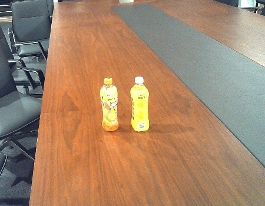
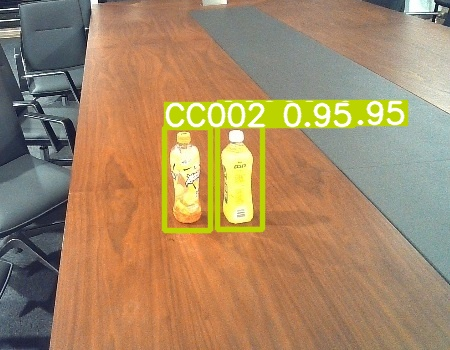
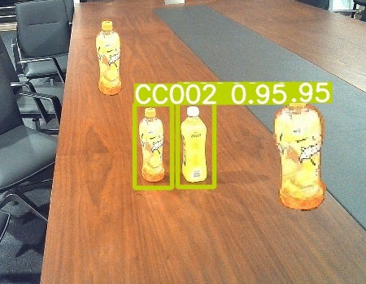

To enable YOLO to utilize information from both RGB images and depth images for object detection, we simply stack the two types of images based on YOLOv5, changing the shape to [w, h, 6].

This code was written over six months ago for a competition, and I am now open-sourcing it. However, the original dataset has been lost, so I cannot verify whether `train.py` runs correctly; I have confirmed that `detect.py` works fine.

For a scenario like this: (RGB.jpg | DEPTH.jpg)

Predictions can be made, and the results are as follows:

Next, we add a "sticker" only to RGB.jpg and DEPTH.jpg:

Predictions yield the following results:

