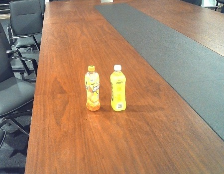
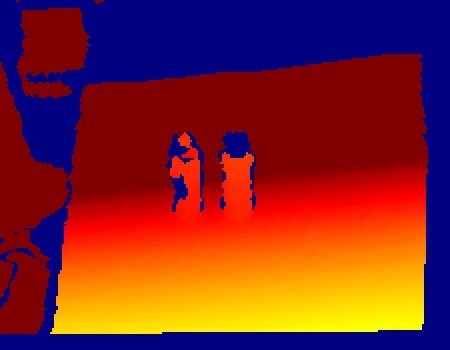
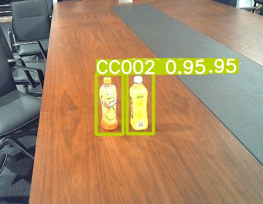
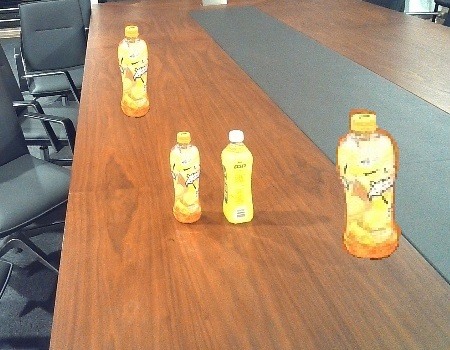
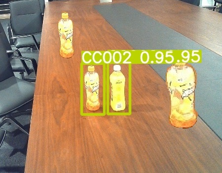

为了使yolo可以同时利用RGB图和深度图的信息进行目标检测，简单地，基于yolov5，将两种图进行堆叠，形状变为[w, h, 6]。

这个代码是我半年多前为一个竞赛写的，现在将其开源出来，不过原来的数据集丢失了，无法验证train.py是否能正常运行，已验证detect.py可以正常运行。

对于这样一个场景：（RGB.jpg  |  DEPTH.jpg）

可以进行预测，结果如下：

接着我们只对RGB.jpg添加“贴画”，DEPTH.jpg：

进行预测，结果如下：

